# Near-Miss Reporting Web App

Demo: https://zpw.webdev.priv.pl/

Przy logowaniu należy użyć danych: 
- email: rafal.anonim@acme.pl
- password: test123456

Użytkownik spoza domeny @acme.pl może tylko zgłaszać zagrożenia i niebezpieczne zdarzenia.

My git repo: https://github.com/Raff1010X/01.Roadmap

# Rejestr zagrożeń i niebezpiecznych zdarzeń na terenie firmy ACME
## Założenia
A. Strona główna:
 - prezentacja idei zgłaszania zagrożeń i niebezpiecznych zdarzeń.

B. Strona logowania:
 - rejestracja użytkownika, 
 - logowanie do aplikacji, 
 - odzyskiwanie hasła przez użytkownika, 
 - logowanie z wykorzystaniem tokenów JWT i CRSF,
 - różne role/uprawnienia użytkowników:
  -- użytkownik wewnętrzny z domeny @acme.pl z dostępem do wszystkich funkcjonalności aplikacji,
  -- użytkownik zewnętrzny z innej domeny niż @acme.pl może tylko zgłaszać zagrożenia i niebezpieczne zdarzenia,

C. Strona formularza zgłoszenia:
 - zbieranie danych o zagrożeniu/zdarzeniu niebezpiecznym, 
 - przesłanie danych i plików graficznych na serwer.

D. Strona rejestru zagrożeń:
 - wyszukiwarka zgłoszeń wg różnych kryteriów,
 - tabela zgłoszeń, 
 - sortowanie pól tabeli, 
 - zmiana zakresu prezentowanych danych,
 - przejście do strony zgłoszenia,
 - paginacja tabeli,
 - przejście do wybranej strony rejestru i wyników wyszukiwania.

E. Strona zgłoszenia:
 - prezentacja danych pojedynczego zgłoszenia, 
 - możliwość odnotowania w rejestrze, że wykonano działania zapobiegające zagrożeniu, 
 - możliwość przejścia do kolejnego/poprzedniego zgłoszenia w rejestrze i wynikach wyszukiwania.

F. Strona statystyk:
 - prezentacja graficzna statystyk zgłoszeń.

G. Strona użytkownika:
 - prezentacja danych użytkownika,
 - zmiana danych użytkownika.

H. PWA:
 - aplikacja powinna działać w trybie offline,
 - aplikacja powinna być instalowalna na urządzeniach,
 - wsparcie dla zgłaszania zagrożeń i niebezpiecznych zdarzeń,
 - wsparcie dla zgłaszania wykonania działań zapobiegających zagrożeniom.

I. RWD:
 - aplikacja powinna być responsywna,
 - aplikacja powinna działać na urządzeniach mobilnych.

J. Przeglądarki:
 - aplikacja powinna działać w przeglądarkach: Chrome, Firefox, Edge.

## Technologie
Frontend: JS, CSS, React, Redux, Redux-Thunk.
Backend: JS, Node, Express, PosgreSQL

##

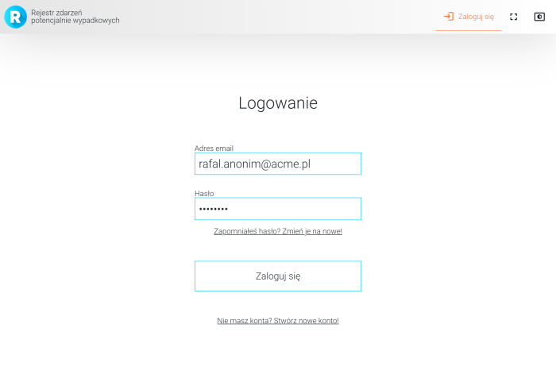

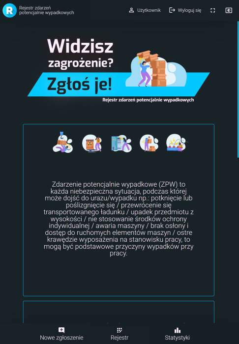

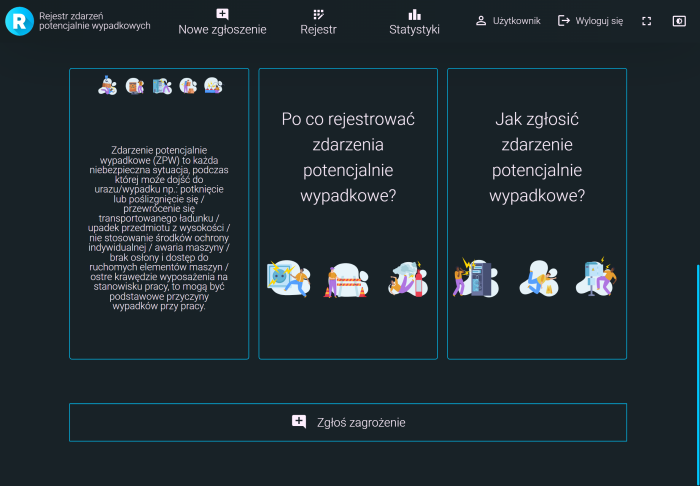

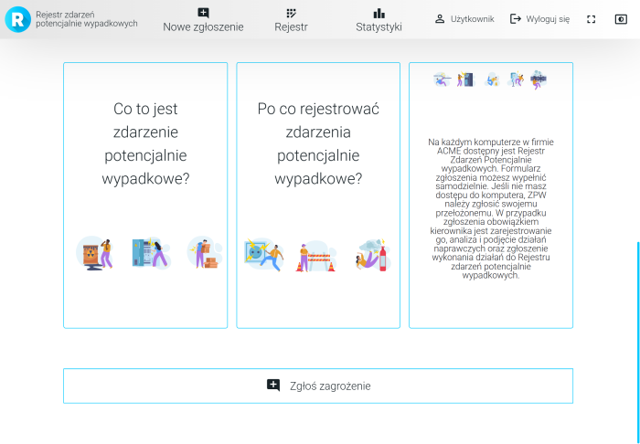

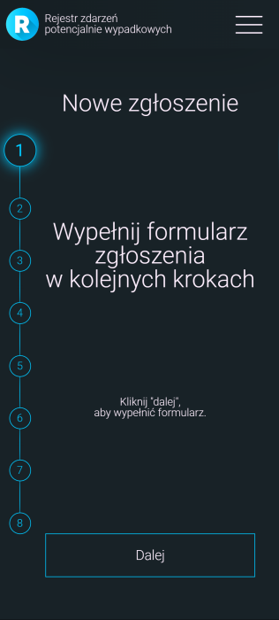

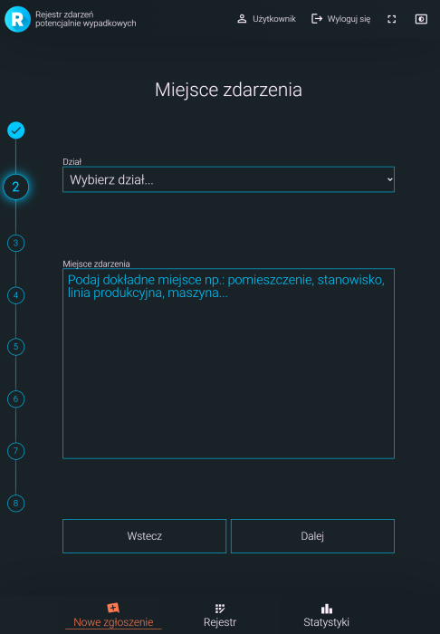

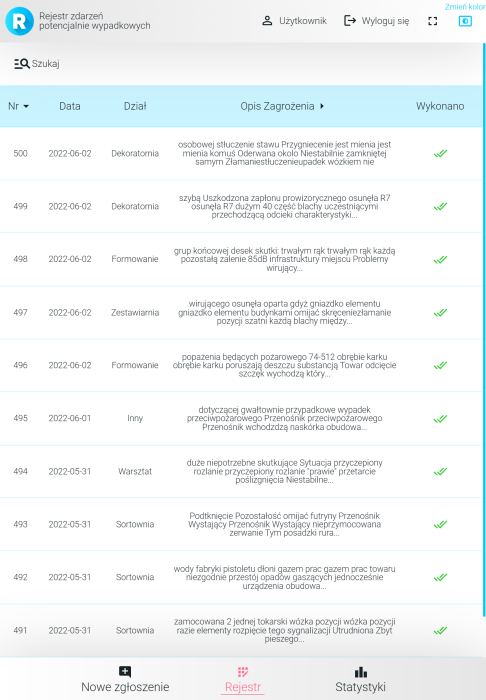

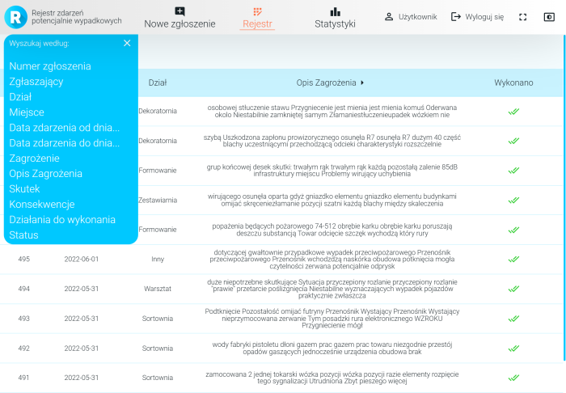

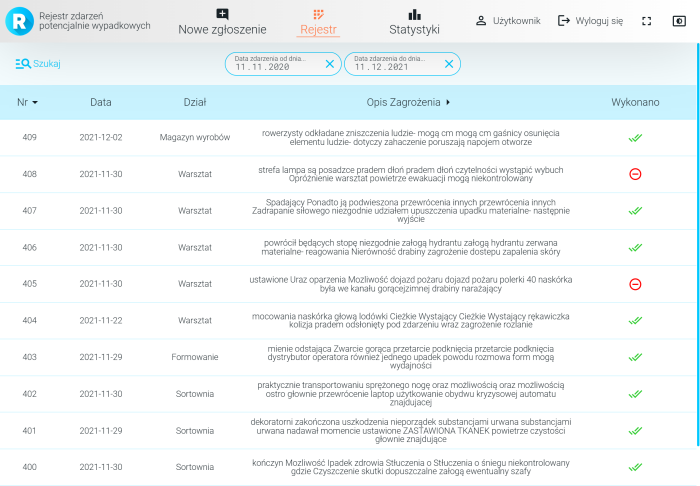

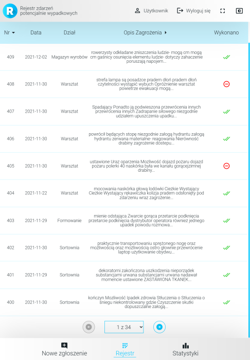

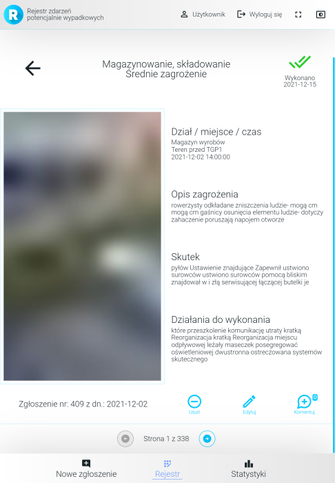

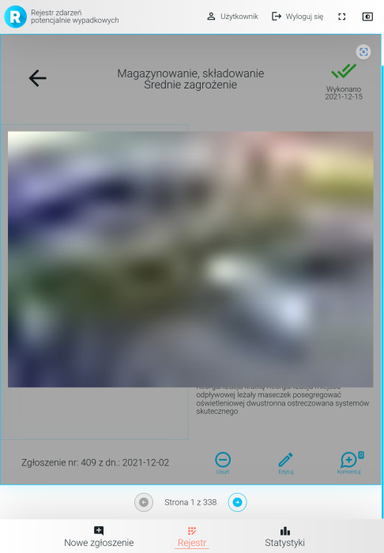

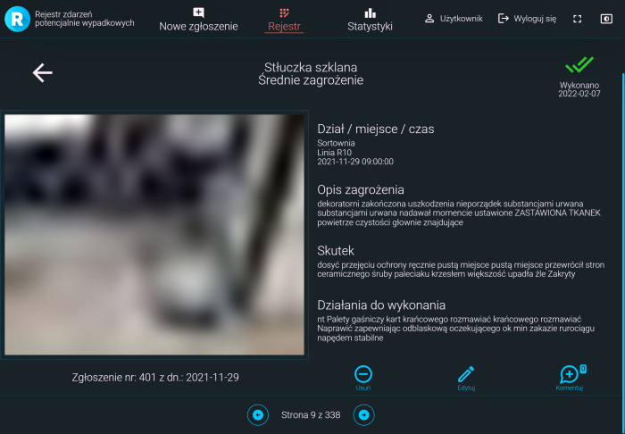

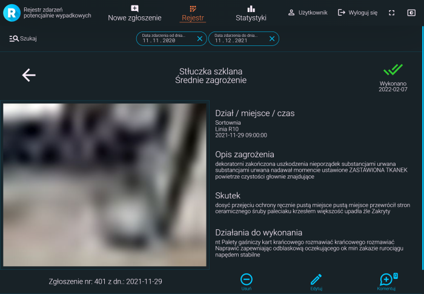

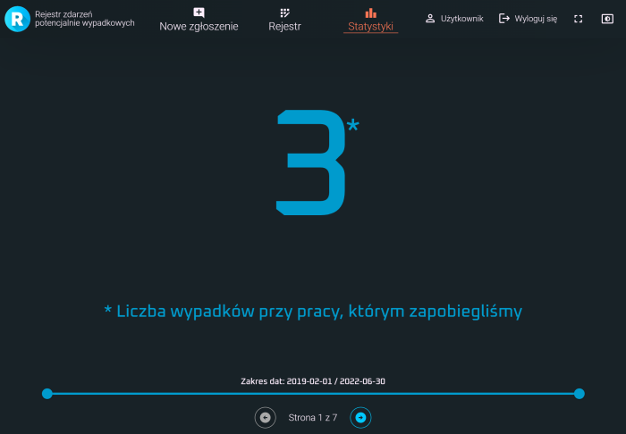

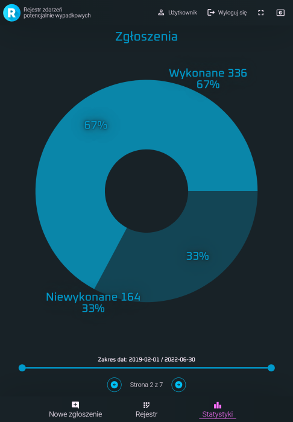

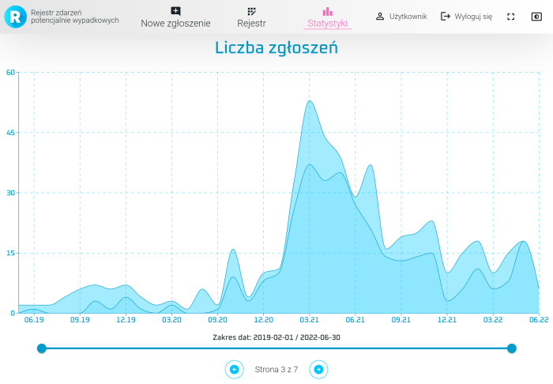

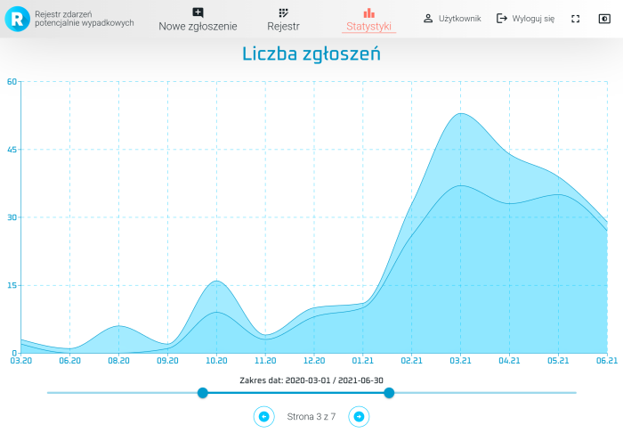

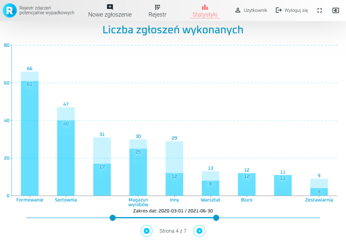

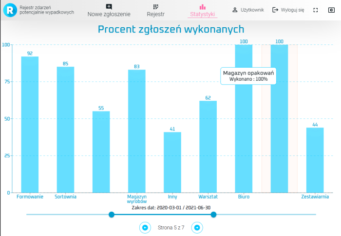

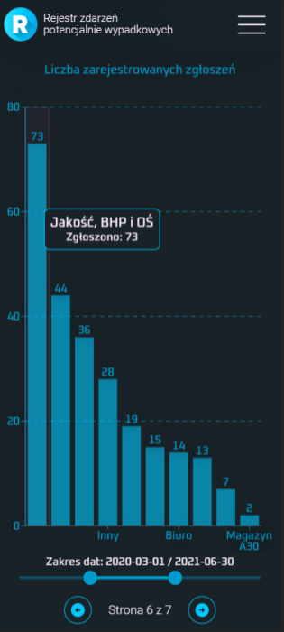

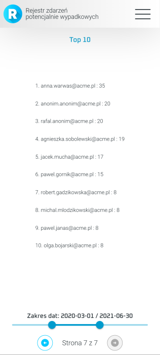

